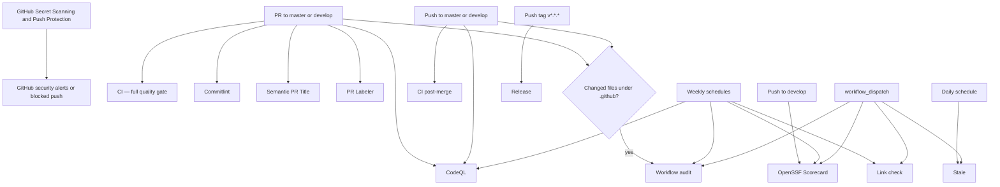
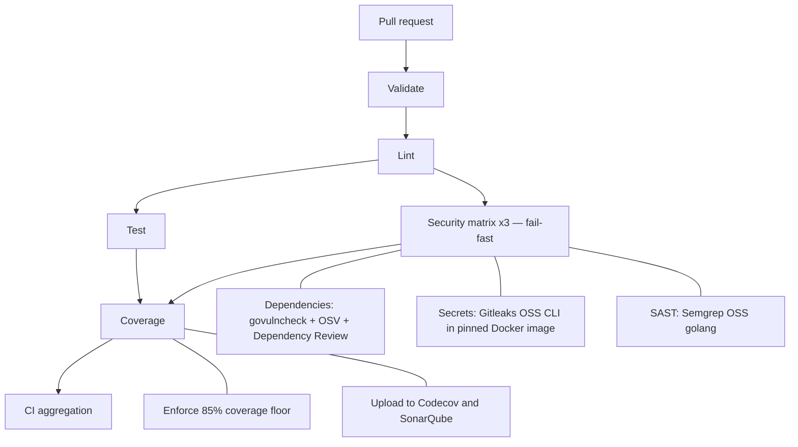

# GitHub Actions workflow flow

This document describes the workflows currently defined in
`.github/workflows/`. All jobs run on GitHub-hosted `ubuntu-latest` runners.
Go commands run through the repository Docker Compose setup
(`tools/ci/docker-compose`). The pull-request gate and the post-merge pass are
split into two workflows; branch protection on `master`/`develop` requires the
pull-request checks before merge.

## Overall event flow



## Pull-request gate (`ci.yml`)

**Trigger:** pull requests targeting `master` or `develop`.
Concurrent runs for the same pull request cancel older in-progress runs.



Every Go job builds the CI image, restores Go module caches under `.cache`
(keyed on `go.sum`), then runs its tool. The security matrix legs share the
job definition and select their tool via the matrix name. The leaf `CI` job
aggregates Validate → Lint → Security → Test → Coverage for a single
branch-protection context when needed.

Coverage floor is **85%** of statements (`go tool cover -func`).

`CODECOV_TOKEN` and `SONAR_TOKEN` are organization secrets — grant this
repository access when onboarding. `SONAR_HOST_URL` is optional (defaults to
`https://sonarcloud.io`). Project key: `jooservices_go-jabledownloader`.

## Post-merge pass (`ci-post-merge.yml`)

**Trigger:** pushes to `master` or `develop` (i.e., right after a merge).

```text
Validate → Test → Coverage → Codecov + Sonar
```

A light sanity pass only: linting and security scanning already gated the
pull request, so the post-merge run verifies the freshly created merge
commit and refreshes coverage baselines.

## Release flow (`release.yml`)

**Trigger:** push of a tag matching `v*.*.*`. Runs are not cancelled.

The workflow fails if the tag is not reachable from `origin/master`. Do not
tag until the maintainer approves the release. Artifacts are cross-compiled
archives under `dist/`.

## Other workflows

| Workflow | Trigger | Flow / result |
| --- | --- | --- |
| `codeql.yml` | Push/PR on `master` or `develop`; Monday 06:00 UTC | CodeQL for Actions YAML (`Analyze GitHub Actions`) and Go (`Analyze Go`) |
| `commitlint.yml` | PR opened, edited, synchronized, reopened | Every PR commit vs `.github/commitlint.config.mjs` |
| `semantic-pr.yml` | PR opened, edited, synchronized | PR title type + uppercase subject start |
| `pr-labeler.yml` | PR opened, synchronized, reopened | Labels from `.github/labeler.yml` |
| `link-check.yml` | Monday schedule; manual | Lychee Markdown link check |
| `scorecard.yml` | Push to `develop` (default branch; `publish_results`); Monday schedule; manual | OpenSSF Scorecard → SARIF |
| `stale.yml` | Daily; manual | Stale issues/PRs |
| `workflow-audit.yml` | `.github/**` changes; Monday schedule; manual | Actionlint + Zizmor |

## Required status checks

Branch protection on `master` and `develop` requires (exact names), same shape
as mature JOOservices packages (`dto` / `client`), adapted to this Go gate:

- `Validate`
- `Lint`
- `Security (Dependencies)`
- `Security (Secrets)`
- `Security (SAST)`
- `Test`
- `Coverage`
- `Analyze GitHub Actions`
- `Analyze Go`
- `Validate commit messages`
- `Validate PR Title`

Strict mode requires the branch to be up to date. Force pushes and deletions
are denied. Admins cannot bypass protection (`enforce_admins` is on). Merged
head branches are deleted automatically (`delete_branch_on_merge`).

## Notes

- All jobs use GitHub-hosted `ubuntu-latest`. There is no self-hosted runner pool.
- All declared workflows use dedicated repository configuration; none use
  `jooservices/workflows`.
- Secret scanning has two layers: GitHub Secret Scanning and Push Protection
  detect or block supported secrets at GitHub, while the pull-request gate
  scans the checked-out Git history with the MIT-licensed Gitleaks OSS CLI
  (`--config=.gitleaks.toml`).
- Documented runners and Docker paths must match the YAML. Prefer changing the
  workflow files first, then update this document in the same PR.
